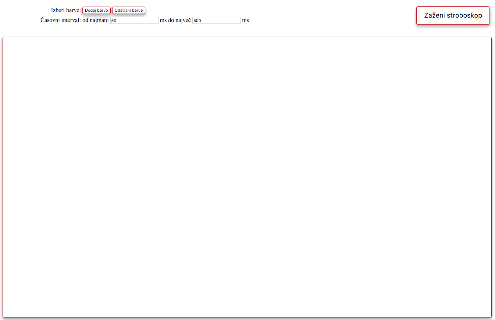

# Spletni barvni stroboskop

1\. domača naloga pri predmetu [Osnove informacijskih sistemov](https://ucilnica.fri.uni-lj.si/course/view.php?id=54) (navodila)


## 6.1 Opis naloge in navodila

Na Bitbucket je na voljo javni repozitorij [https://bitbucket.org/asistent/stroboskop](https://bitbucket.org/asistent/stroboskop), ki vsebuje nedelujoč spletni stroboskop. V okviru domače naloge ustvarite kopijo repozitorija ter popravite in dopolnite obstoječo implementacijo spletne strani tako, da bo končna aplikacija z vsemi delujočimi funkcionalnostimi izgledala kot na spodnji sliki. Natančna navodila si preberite na [spletni učilnici](https://ucilnica.fri.uni-lj.si/mod/workshop/view.php?id=19181).



## 6.2 Vzpostavitev repozitorija

Naloga 6.2.2:

```
((UKAZI GIT))
```

Naloga 6.2.3:
((UVELJAVITEV))

## 6.3 Skladnja strani in stilska preobrazba

Naloga 6.3.1:
((UVELJAVITEV))

Naloga 6.3.2:
((UVELJAVITEV))

Naloga 6.3.3:
((UVELJAVITEV))

Naloga 6.3.4:
((UVELJAVITEV))

Naloga 6.3.5:

```
((UKAZI GIT))
```

## 6.4 Dinamika in animacija na strani

Naloga 6.4.1:
((UVELJAVITEV))

Naloga 6.4.2:
((UVELJAVITEV))

Naloga 6.4.3:
((UVELJAVITEV))

Naloga 6.4.4:
((UVELJAVITEV))